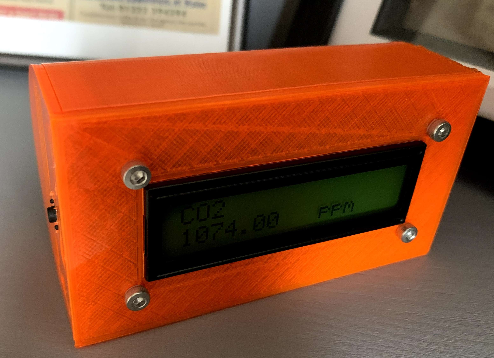
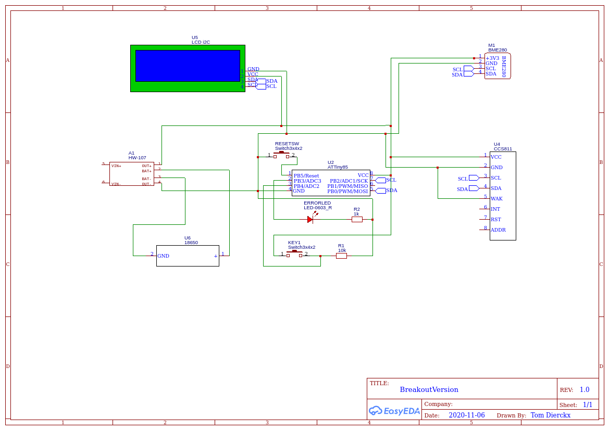
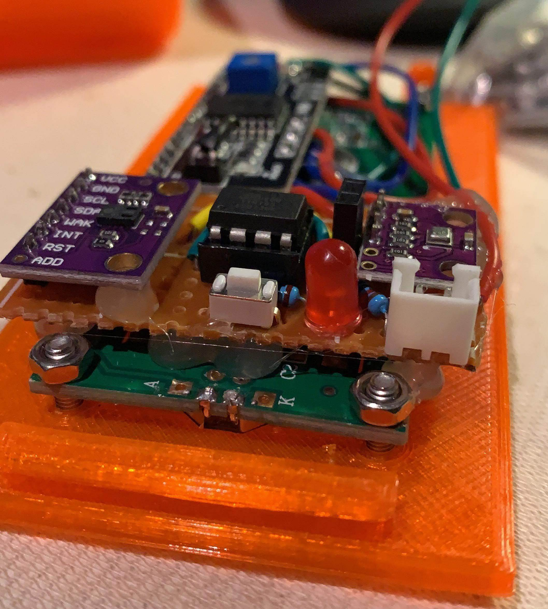
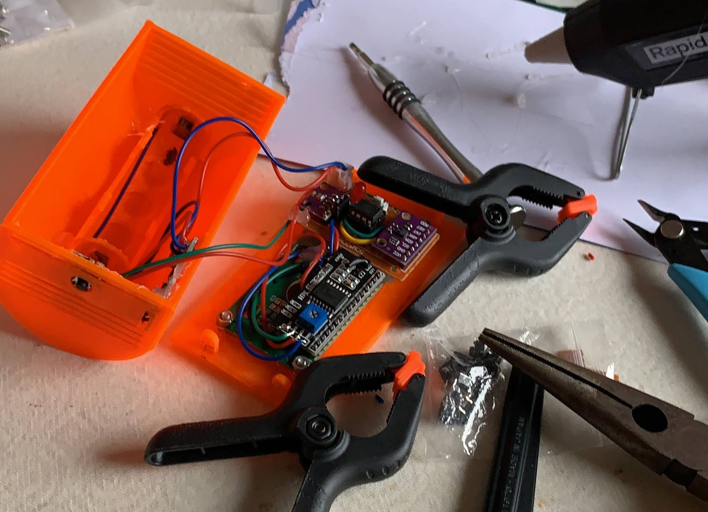

# Battery powered portable air quality station

As we have all been more indoors during the COVID crisis. Keeping rooms well ventilated is important. I build this station as a reminder to open my windows from time to time.

This build is capable of measuring: CO2, Volatile organic compounds, temperature (degrees Celsius this can be changed in code), humidity and barometric pressure. As this uses i2c to connect to the sensors any other i2c 3.3V enabled sensor can probably be used.

I decided to build an AirQ station in March that I have been using to monitor the indoor air levels. The sensors are not calibrated and cannot be relied on for medical uses I just compare the air quality when the windows is open compared to a closed window.

The old version was based around the CCS811 and the DHT22 sensor. I wasn't happy about the code so I only published the DHT22 part [here](https://github.com/tom-dierckx/DHT-attiny85-i2c) and the 3d printed case [here](https://www.thingiverse.com/thing:4262574).

We are in a lock-down again so it was time for a revision, a portable version powered by a battery. This time I removed some unused features (previous version could store on an SD card using SPI) and switched the Arduino mini with an Attiny85 running on a lower clock (1 Mhz internal).  
I also changed the DHT22 to the much more accurate and also i2c enabled BME280 sensor.

## Components

### Sensors

I used breakouts of the following sensors acquired on Aliexpress.

CCS811 3.3V version:
- CO2 particles in the air
- Volatile organic compounds

BME280 3.3V version:
- Temperature
- Humidity
- Air pressure

Both of these breakouts expose an i2c interface (and spi) that we will use.

### Other electric components/modules

Items needed for the electronic circuit:
- LCD display with the i2c interface attached.
- Attiny85
- Lithium battery charger (based on the TP4056)
- Lithium Ion Battery (Type 18650)
- Red LED (for debugging)
- Resistor 1K Ohm 
- Resistor 10K Ohm
- Button
- PCB Prototype Matrix

And a couple of M3 nuts and bolts.

Printable components:

Battery case: I used this 18650 battery case that I found on Thingiverse [here](https://www.thingiverse.com/thing:535688) it worked well even if it is deprecated (used aluminium from a coca cola can as leads).

Arduino UNO for programming the attiny85 and a 10uF electrolytic capacitor.

As I'm just doing this in my spare time I just use my glue gun to fix everything in place. So if you do not change the models you are going to need a glue gun and alot of glue :D.

### Connecting everything together.

#### Schematic

I just connected all the i2c interfaces together. And attached the button and a red LED to the attiny85. The red led is the `errorPin` in code and will get lit when the attiny cannot setup a connection with a sensor.

The button is used to cycle all the sensor values on the display.

### Assembling the display and logic

Solder all parts together as shown on the picture. I added a lot of hotglue and tried to not create any shorts.

### Assembling the battery holder charching module and button

Again using hotglue is key :D

## Code part

Just import this repository in platformIO and you should be good to go, the code isn't that complex. If you have any questions you can always contact me on Github.

I used this [documentation](https://create.arduino.cc/projecthub/arjun/programming-attiny85-with-arduino-uno-afb829) for flashing an Attiny85 using an arduino UNO. 

Settings in the `platformio.ini` file work with this method (Do not forget the electrolytic capacitor!).

### Attiny85 bootloader

I installed the bootloader with the 1Mhz internal clock configuration this is the lowest clock (the lower the clock the lower the powerconsumption) before making the code unstable.

## Can we finally build the thing please

I uploaded the STL files to Thingiverse. You can find these [here](https://www.thingiverse.com/thing:4645516).
Or in the `/images` directory.

The STL files are also added to this directory in the `3ddesigns`

